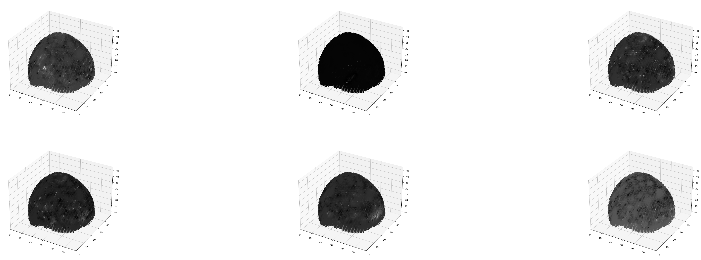
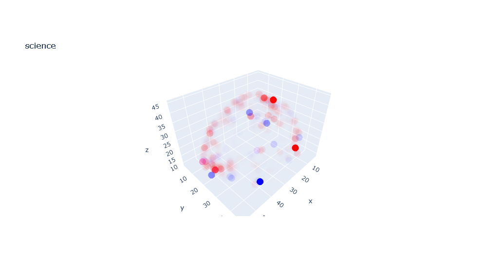
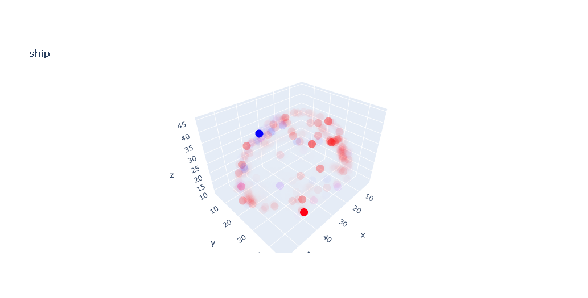
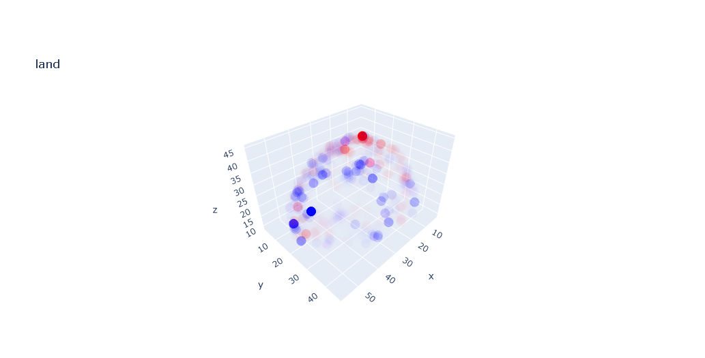

# Lys toy project

## Notes

Before I began I did the following

### Exploration work:
1. Kaggle.com - has a few fnirs features but really nothing that I found useful, not even documented e.g. [this one](https://www.kaggle.com/datasets/michaelfink0923/merged-fnirs-and-behavioral-dataset)
2. Hugging face - 3 models have something to do with fNIRS but none is documented in any way, useless to us

In my explanation of my process, I made the following

### Assumptions

1. I use 'neurons firing' or 'neurons activating' as a proxy for 'voxels with significant HBO/HBR values' as that's what Wikipedia promises in this article (after all these values serve as proxies to how neurologically active the different parts of the brain are): https://en.wikipedia.org/wiki/Neurovascular_unit
2. This paper says HBO and HBR are inversely correlated and also suggests a new supposedely better approach of extracting information from the fNIRS hardware: https://www.mdpi.com/1424-8220/23/8/3979
    > The HbO and HbR signals induced by brain activity are negatively correlated. Neuronal activity triggers the increase in arterial, HbO-rich blood supply via neurovascular coupling. As a consequence, the blood volume increases locally and the relative HbO concentration increases while the relative HbR concentration decreases.
3. Multiple papers talk about how accurate fNIRS measurements need to be broken down to short and long channels (e.g. https://pmc.ncbi.nlm.nih.gov/articles/PMC7757903/). It's unclear how the current dataset was measured so it might be affected by extra noise.
4. This paper talks about massive gender/age differences in the recorded fNIRS data: https://www.researchgate.net/publication/326962527_Impact_of_Healthy_Aging_on_Multifractal_Hemodynamic_Fluctuations_in_the_Human_Prefrontal_Cortex. This means any actual brain decoder would have to isolate all of that noise.
5. This website seems to give a good summary of fNIRS data analysis but I don't have time to read it all - probably a good idea: https://pvrticka.com/fnirs-hyperscanning-an-introduction/. Key information I'm using from it:
    - HBO is more closely corelated with the actual neural excitement than HBR. I use this for training purposes to define a target feature for our training algorithm. This is further confirmed by our data as well - my plots of the HBO vs HBR show much bigger HBO effect for a random collection of concepts.
    - Task duration is critical - that website and also some other papers I lost the links to, discuss that ideal duration should be in the 15-30s range (even the haemodynamic response curve from Wikipedia is plotted over 15s with the peak response arriving about 5s after the signal). This is quite worrying as most of the stimuli in our sample data takes only 3s but that's one more thing to ignore.

### Requirements

This is a quick breakdown of how the code works:
1. My dependencies are numpy, pandas, Jupyter, pytorch, gensim and plotly. Just run `pip install` on each.
2. All my tests were done in python 3.14. The Jupyter notebook was ran inside Visual Studio Code, I'm not exactly sure it can run without it (probably the kernel has to be adjusted)
3. All code is in the /src folder. Quick overview of each file is below:
- notebook.ipynb - the notebook (duuh)
- entries.py - contains a few frequently used classes
- decoder.py - processes the input data into data formats that allow easier usage
- embedder.py - manages GloVe data
- trainer.py - common training facilities
- trainer-nn.py / trainer-linear....py - train particular models
- experiment.py - my testing grounds - I used it to play with the data, for example to extract and save all activation data per concept

4. If you want to run any of the code examples, you'd have to add all the input data in the data folder. I wanted to upload everything to Github via Git LFS but turns out even Github has a 2GB-per-file limit for LFS for my plan so that made it impossible. So you have to add the data files here:
  - `data/glove/glove.840B.300d.txt`
  - `data/lys_trial_data/session-N/*` for every N in [1-6]

5. Some interediate results are cached inside `data/cache/` so don't be surprised if you run the code and that causes new files to be created.

## My process

I thought the best approach for me to explain my work is to walk you through all the steps I took to produce what I produced. The end result doesn't really work as a decoder but I imagine you are 10 times more interested in my approach than in whatever bugs I have missed to fix.

### Step 1: data needed to be masked

My first step was to explore the data:

-> Usually Notepad++ can open even pretty large files without issues but it died immediately

-> Next I used `head` to browse the data only to be welcome by a gazillion 0s (I expected the data to be much more dense)

-> Ok, so if I can't visualize it textually, time to plot

-> Wait, what's this format even? I initially expected either:
- `[x, y, z, hbo, hbr]` for every entry
- or parallel arrays - `[x: [...], y: [...], z:[...], hbo:[...], hbr:[...]`

It took me a while to realize it was actually `x: [y: [z: [hbo:]]` but once done, the next step was extracting it and matching it to concepts

### Step 2: Mapping to concepts

Concepts are not unique within a session - some concepts appear more than once, some don't appear in all sessions. Aggregating the signal from different instances of concepts is tricky - it's unclear what function would be good to use to aggregate the results. Also quite unclear if the worldcloud should be used in any way and how does it affect every stimulus instance.

First step would be to plot single stimulus instances and then figure out aggregation.

### Step 3: First plotting results

Plotting the values results in a very satisfying brain shape but the Hbo / Hbr values seem all over the place; there's clearly lots of noise.

I should update the plot to take the difference between the rest period and the actual stimulus to remove all the noise from the hemodynamic response.

What Hbo value do we actually plot? There's roughly 3 data points per concept (about 1s and stimuli are active for 3s on average) so how do we combine them? Let's just plot them all, for example for `concept[0]`:



### Step 4: Cleaning up the plot

The plot is extremely slow to render since the data takes forever to load and also the data is a bit unclear. Let's clean it up:


The hemodynamic response curve starts strong and then quickly decays.


This means we are likely interested in taking just the amplitude of the result. This is further discussed in [this paper](https://www.sciencedirect.com/science/article/pii/S266695602200023X) which confirms HBO/HBR's amplitude can be used as a proxy for neural activity.

Lots of HBO/HBR values are close to zero. I assume that whatever haemodynamic response a concept triggers, would cause a much bigger effect in certain regions and we'd be able to select that large response as a predictor - instead of looking at the entire brain data. Hence, let's update the data by
  - define 2 functions for aggregating the signals - 1 for aggregating within the same stimulus instance and 1 across instances. Use `max` to aggregate results within the same instance (as per the paper above). Use `average` to aggregate across instances (unclear if that's the best choice)
  - boost the signal by raising it to the power of 2 to increase the ampltitude between 'strong' response and 'weak' response
  - normalize the values of hbo/hbr by mapping it to the max/min range of each variable
  - draw both at the same time by putting 1 in the red channel and 1 in the blue channel
  - make transparent any voxel whose hbo/hbr values don't meet a certain treshold

And here are some of the results





Clearly the different concepts yield different activations so this tells us they should be good enough to use as predictors.

### Step 5: Mapping brain data to concepts

I should probably take into account the positioning and type of the core words around the main concept but for this experiment I will ignore them. Figuring out how to integrate them in the training data seems like a very arbitrary choice so it's unclear if it would be helpful - rather have something working than waste time trying to experiment with it.

To actually make it learn, I need to produce a data mapping from brain data as input to the GloVe vector embeddings.

This is my first time working with GloVe - I need to understand the structure of their embeddings. So let's plot it!


This chart above plots all concepts across all embedding axes. None of them seem to have any clear semantic meaning unfortunately? Some of them seem to have stuff in common like "more good" and "more bad" concepts but there also lots of weird ones. I guess the famous `king - queen + man = woman` example uses a non-basis vector.

Alright, second attempt at plotting this, let's display a particular concept - `concept[0] == land`:


Clearly there's a dimension that land is much more strongly attached to...but does that help us? Well, not really, it's still as impossible to interpret. I guess we need to drop the semantic idea completely.

### Step 6: Training a model

I am considering 2 types of models:
  - Train a single predictor (doesn't matter what kind exactly, but let's say a NN) that takes as input activated neurons and returns a vector in the GloVe embedding space, then take closest neighbour of the predicted embedding
    - **pros**: just a single model, can detect more complex patterns, more likely to overfit
    - **cons**: costlier to train (especially in a home environment)
  - Train a collection of predictors (again, doesn't matter what kind, but let's say linear regression), one per axis in the GloVe embedding space, that focus on predicting how neurons activating correspond to changes in a **single** axis
    - **pros**: can be trained one at a time (saves development time), less overfitting,   clear path to interpretability - for every axis, plot every concept's embedding value, plot how neurons predict each axis
    - **cons**: assumes the axis in the embedding space are linearly independent (which is unlikely to be true)

Option 2 is much simpler so let's start with it.

### Step 7: Feature engineering:

As we've established previously, the data is sparse and the majority of it mostly 0s. From the plots it seems that most of the brain activations happen only in the cerebral cortex  - which isn't surprising but it's important since it means we can discard almost all vortices - hence, first step would to only include non-zero vortices.

So let's make every non-zero vortex a feature - we don't really care about the specific coordinates (may be we should but I assume we don't). So every training input would only contain the HBO/HBR values per vortex, sorted by vortex coordinates.

Example, the entry `[{x: 5, y: 6, z: 7, hbo: 5}, { x: 5, y: 6, z: 8, hbo: 6 }]` would yield training examples of `[5, 6]`. The output would be the embedding values of our concepts.

We could have input value for every vortex's HBO and HBR but that would again slow us down since there's lots of data to process. Papers suggest that HBO is more closely corelated to the actual neural activation. For that reason, and for a lack of deeper neuroscience knowledge, and for the sake of designing a simpler predictor for the experiment, I'll use a target feature that merges the HBO and HBR value, higher weight for HBO with.

```py
def calculate_goal_feature(entry: decoder.ConceptActivationEntry, w1=2.0, w2=1.0) -> float:
    """
    Calculate combined feature for a vortex using weights w1 and w2 - this makes the implementation
    easier because we don't have to deal with multi-dimensional outputs in the model.
    The values are completely arbitrary and can be tuned later.
    HBO is weighted more heavily because it tends to have stronger corelation
    with brain activation according to some papers.
    """
    return entry.hbo * w1 + entry.hbr * w2
```

### Step 8: Training time: collection of linear regressions!

Since processing data is super slow, cache results in temporary files & run in parallel. There also are alternative ways to order the pipeline but not worth it to spend the time right now. For example, see how `trainer.load_vortex_activations` caches activations per session data list.

In an ideal world, the training would be cross-validating by training 1 model per subset of the input data e.g. `sessions[0:5], sessions[0, 2:6]`, etc, hence why `load_vortex_activations` stores which sessions it works on. In practice, the code turned out to be too slow to run for so the actual results are only produced on 1 subset of the data.

I use `pytorch` because it seemed to be the most simple to setup.
For managing GloVe, I use `gensim`.

Code for this experiment is in `trainer-linear-regression-per-axis.py`.

### Step 9: Results

First attempt at predicting with 1 linear regression model per dimension yields clearly unsatisfactory results because it always predicts the same output words.

I fed the model the input data for particular concepts with the expectation that it would return the word embeddings for these words. Then asked the GloVe model to find the words closest to that embedding and sadly found the results returned everywhere:

```
Brain data for concept: beer
Predicted: [('even', 0.7778807878494263), ('way', 0.7691137194633484), ('enough', 0.7685062885284424), ('when', 0.7630759477615356), ('rather', 0.7577996253967285), ('so', 0.7554799914360046), ('it', 0.7542943358421326), ('kind', 0.7512275576591492), ('that', 0.7511142492294312), ('because', 0.7501003742218018)]
Brain data for concept: big
Predicted: [('even', 0.7778807878494263), ('way', 0.7691137790679932), ('enough', 0.7685062885284424), ('when', 0.7630759477615356), ('rather', 0.7577996253967285), ('so', 0.7554800510406494), ('it', 0.7542943358421326), ('kind', 0.751227617263794), ('that', 0.7511142492294312), ('because', 0.7501003742218018)]
Brain data for concept: bird
Predicted: [('even', 0.7778807878494263), ('way', 0.7691137790679932), ('enough', 0.7685062885284424), ('when', 0.7630759477615356), ('rather', 0.7577996253967285), ('so', 0.7554800510406494), ('it', 0.7542943358421326), ('kind', 0.751227617263794), ('that', 0.7511142492294312), ('because', 0.7501003742218018)]
...
```

### Step 9: Results

Clearly this didn't work - it's a bit unclear if that's because of the bug in the data or the collection of linear regressions cannot actually learn the underlying distribution.

Let's try again - second attempt, using a *massive* NN and 300 epochs of training:

```py
self.nn_stack = torch.nn.Sequential(
    torch.nn.Linear(brain_data_dim, 2048, dtype=torch.float64),
    torch.nn.ReLU(),
    torch.nn.Linear(2048, 1024, dtype=torch.float64),
    torch.nn.ReLU(),
    torch.nn.Linear(1024, 512, dtype=torch.float64),
    torch.nn.ReLU(),
    torch.nn.Linear(512, DIMENSIONS_TO_PREDICT, dtype=torch.float64),
)
```

Code for this experiment is in `trainer-nn.py`.

Unfortunately the results came exactly the same which clearly points to a bug in the pipeline. Given the fact that all input vectors yield the same output, and that plotting the input data resulted in significantly different plots, I suspect that I'm using the GloVe embeddings in a wrong way.
1. Am I mapping all inputs to the same outputs?
2. Am I feeding the same input in all tests?
3. Am I processing the training example differently / wrongly compared to the plotting setup?

I looked at the code but didn't find any obvious signs of problems.

```
Concept: beer
Predicted: [('even', 0.8025636672973633), ('way', 0.7976251840591431), ('kind', 0.7914940118789673), ('because', 0.787828803062439), ('that', 0.7871248722076416), ('but', 0.785133421421051), ('rather', 0.7827553153038025), ('so', 0.7822287082672119), ('nothing', 0.7790669798851013), ('it', 0.7789224982261658)]
Concept: big
Predicted: [('even', 0.8025636672973633), ('way', 0.7976251840591431), ('kind', 0.7914940118789673), ('because', 0.787828803062439), ('that', 0.7871248722076416), ('but', 0.785133421421051), ('rather', 0.7827553153038025), ('so', 0.7822287082672119), ('nothing', 0.7790669798851013), ('it', 0.7789224982261658)]
Concept: bird
Predicted: [('even', 0.8025636672973633), ('way', 0.7976251840591431), ('kind', 0.7914940118789673), ('because', 0.787828803062439), ('that', 0.7871248722076416), ('but', 0.785133421421051), ('rather', 0.7827553153038025), ('so', 0.7822287082672119), ('nothing', 0.7790669798851013), ('it', 0.7789224982261658)]
...
```

What? Is my training data the same for all examples or what's happening?

## Ideas to explore if I had infinite time:

### Idea 1: Change of basis

Change the basis of the GloVe embeddings into dimensions that actually have assigned semantics e.g.
    - embeddings[0] to signify gender (`dot(king-queen, w) for w in glove`)
    - embeddings[1] to signify goodness (`dot(good-bad, w) for w in glove`)
    - etc.
    
This would provide much greater level of interpretability of any model being trained which for an actual brain decoder product would be invaluable.

### Idea 2: Take inspiration from Arabic

I am a language nerd and living in Dubai exposed me to Arabic. Allow me to explain how Arabic is different and why that matters to this use case.

Arabic and other Semitic languages don't form words with prefixes + root + suffix but instead through pattern matching. Here are some examples for the root *k-t-b* for *"something related to writing"*
  - *k-t-b* (root) + *CaCaaC/ (pattern for object) = kitaab = book i.e. "writing" + "object" = "book"
  - *k-t-b* (root) + *CaCiC* (pattern for subject) = katib = writer i.e. "writing" + "subject" = "writer'
  - *k-t-b* (root) + *maCCaC* (pattern for place of action) = maktab = desk i.e. "writing" + "place of action" = "desk"

On the other hand, the root *d-r-s* stands for *"something related to learning"* so

  - *d-r-s* + *maCCaC* = madrasa = school (root for "learning" + pattern for "a place of action")

There have been medical studies confirming that Arabic speakers actually form words in two dimensions - *"what the word relates to"* vs *"what information the word passes"*. What if everyone actually forms words in multiple dimensions but we just haven't realized that and we can actually map different brain regions to 'roots' and 'patterns'?

Study link from MIT here: https://direct.mit.edu/ling/article-abstract/31/4/609/100/The-Mental-Representation-of-Semitic-Words?redirectedFrom=fulltext

### Idea 3: Remove noise from the training examples

My work definitely didn't remove all of the noise from the training examples. Some further suggestions to improve would include:

- is there a difference between the same person at different times of the day? How about different coffeine or alcohol levels? Other factors?
- is there a difference between different language speakers? (goes back to the Arabic idea)
- how big is the measured data difference because of an age or gender difference? How to normalize it?
- map brain regions - are certain regions more excited for more certain concepts? what does neuroscience say about it?
- are all neural activations equally important? Can we reduce the feature count by eliminating low-variance dimensions or dimensions that are more random/noisy?
- is the way the data is gathered correct? What about those studies with the fancy metrics for accomodating movement? Could Thomas have been tired after 2 days of watching concepts on screen and did that affect the outcome? Was 3s per concept sufficient to record the correct response?

### Idea 4: Reengineer the data pipeline

1. Does it even make sense to aggregate the signal per concept before we pass them as training data? What if we use the signals from among all sessions as training examples?
2. What if include the words from the worldclouds in the training data?
3. What does neuroscience say about the corelation of the HBO / HBR in detail instead of by my super-limited understanding of the topic?
4. Do the coordinate indices make a difference in the predicting power?
5. Is the resolution of the fNIRS machine good enough for our purposes? Could it be that we need higher resolution and more data points?

## Conclusions & results

It goes without saying that making "a brain-reading hat" would be a challenging topic to tackle.

At the end, we've got code that can serve as the basis of an actual decoder because it can:
1. parse the input data
2. process it so that it can be plotted or generate training examples
3. feed into the whatever ML model makes sense
